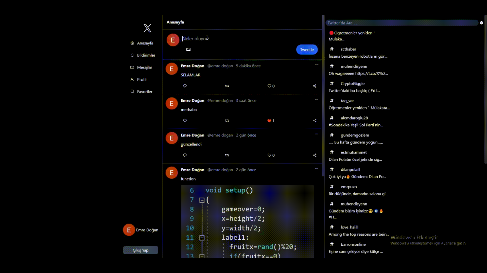

# firebase 
- firebase ile geliştirdiğim twitter clone projesinde firebase'in bir çok özelliğinden yararlanarak eklediğim özellikler mevcut
- Google ile giriş yapma 
- tweetleri güncelleme
- tweet atma ve silme işlemleri
- fotoğraf ekleme

# rapid api 
- rapid api kullanarak aynı zamanda haberler search kısmını da apiden listelemiş bulunmaktayım

# kütüphaneler
- firebase
- react-router-dom
- react-icons
- moment
- react-toastify
- tailwind

